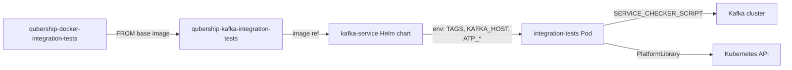

# AGENTS.md

`qubership-docker-integration-tests` (aka **BDI** — Base Docker Image for
integration tests) is a shared Robot Framework runtime image. It is **not**
executed standalone. Downstream Qubership service images (`qubership-kafka`,
`qubership-zookeeper`, etc.) extend it via
`FROM ghcr.io/netcracker/qubership-docker-integration-tests:main`, ship their
own `robot/tests/` suites, and rely on its entrypoint, helper scripts and
Python keyword library.

Published as `ghcr.io/netcracker/qubership-docker-integration-tests`.

## Repository Layout

- `/Dockerfile` — `python:3.14-alpine3.23` based image. Installs Robot
  Framework, `bash`, `vim`, `rsync`, `ttyd`, `s5cmd`, and the
  `integration-tests-builtIn` Python package into `site-packages`. Sets
  `ROBOT_HOME=/opt/robot` and `PYTHONPATH` to the installed library.
- `/debian-build/Dockerfile` — Debian-based variant of the same image.
- `/scripts/` — Entrypoint and helper scripts copied into `${ROBOT_HOME}`:
  - `docker-entrypoint.sh` — main entrypoint (`CMD ["run-robot"]`).
  - `robot_tags_resolver.py` — discovers `tags_exclusion.py` modules under
    `./tests` and builds the `-e ...` argument for `robot`.
  - `analyze_result.py` — parses `output.xml` into a pretty `result.txt`.
  - `write_status.py` — writes integration tests status condition to a
    Kubernetes / Custom Resource entity.
  - `adapter-S3/` — optional Allure / ATP report upload pipeline
    (`adapter-S3-entrypoint.sh`, `init.sh`, `test-runner.sh`,
    `upload-monitor.sh`, `email-notification/`, `runtimes/`).
- `/library/integration_library_builtIn/` — Robot Framework keyword library
  installed as the `integration-tests-builtIn` package:
  - `PlatformLibrary` — main Kubernetes/OpenShift wrapper used by all
    downstream `.robot` suites and by `SERVICE_CHECKER_SCRIPT`s.
  - `KubernetesClient`, `OpenShiftClient` — low-level API clients.
  - `MonitoringLibrary`, `OAuthLibrary`, `S3BackupLibrary`, `s3_storage`,
    `FileSystemS3` — auxiliary keywords.
- `/library/tests/` — `pytest` unit tests for the library
  (`pytest.ini` pins `pythonpath = library/integration_library_builtIn`).
- `/demo/` — local `docker-compose.yml` sandbox for smoke-testing the image
  against a host kubeconfig.
- `/docs/library_documentation/PlatformLibrary.html` — autogenerated
  `libdoc` reference for `PlatformLibrary`.
- `/requirements.txt`, `/test-requirements.txt` — pinned runtime and test
  dependencies (Robot Framework 7.4.2, `kubernetes`, `boto3`, `pytest`, ...).
- `/container-hardening/` — standalone component that verifies Kubernetes
  container security hardening rules (CH1–CH12) across all pods in a namespace:
  - `docker/Dockerfile` — extends BDI; published as
    `ghcr.io/netcracker/qubership-docker-integration-tests-hardening`.
  - `robot/tests/container_hardening/container_hardening.robot` — generic
    Robot suite, driven by `PART_OF` and `EXCLUSIONS_JSON` env vars.
  - `helm/container-hardening/` — Helm chart that runs the suite as a
    `post-install,post-upgrade` Job (fails the Helm release if tests fail).
  - `docker-transfer/Dockerfile` — `FROM scratch` artifact image that packages
    the Helm chart for CI / App Deployer consumption.

## Contracts Downstream Images Depend On

Changes to anything in this list ripple through every consumer. All changes
MUST be backward compatible — add new behaviour through new optional env vars
or new keywords; never repurpose existing ones.

- Image conventions:
  - `ROBOT_HOME=/opt/robot`, working directory is `${ROBOT_HOME}`.
  - `PYTHONPATH` points at the installed `integration_library_builtIn`.
  - Container runs as UID `1000`, primary group `0`.
  - `result.txt` is written under `./output/`.
- Entrypoint `CMD` modes accepted by `docker-entrypoint.sh`:
  - `run-robot` (default) — runs Robot, then starts `ttyd` on `${TTYD_PORT:-8080}`.
  - `run-robot-without-ttyd` — runs Robot and exits with Robot's exit code.
  - `run-ttyd` — only `ttyd`, useful for troubleshooting.
  - `custom` — runs `${CUSTOM_ENTRYPOINT_SCRIPT}`.
- Recognised environment variables (do not rename):
  - Execution: `TAGS`, `SERVICE_CHECKER_SCRIPT`,
    `SERVICE_CHECKER_SCRIPT_TIMEOUT`, `CUSTOM_ENTRYPOINT_SCRIPT`,
    `TAGS_RESOLVER_SCRIPT`, `IS_TAGS_RESOLVER_ENABLED`,
    `ANALYZE_RESULT_SCRIPT`, `IS_ANALYZER_RESULT_ENABLED`,
    `READONLY_CONTAINER_FILE_SYSTEM_ENABLED`, `DEBUG`, `TTYD_PORT`,
    `INTEGRATION_TESTS_SECRETS_DIR`.
  - Status writeback: `STATUS_WRITING_ENABLED`, `STATUS_CUSTOM_RESOURCE_PATH`,
    `STATUS_CUSTOM_RESOURCE_GROUP`, `STATUS_CUSTOM_RESOURCE_VERSION`,
    `STATUS_CUSTOM_RESOURCE_NAMESPACE`, `STATUS_CUSTOM_RESOURCE_PLURAL`,
    `STATUS_CUSTOM_RESOURCE_NAME`, `WRITE_STATUS_SCRIPT`,
    `ONLY_INTEGRATION_TESTS`, `IS_SHORT_STATUS_MESSAGE`, `IS_STATUS_BOOLEAN`.
  - ATP / S3 report upload: `ATP_REPORT_ENABLED`, `ATP_STORAGE_PROVIDER`,
    `ATP_STORAGE_SERVER_URL`, `ATP_STORAGE_SERVER_UI_URL`,
    `ATP_STORAGE_BUCKET`, `ATP_STORAGE_REGION`, `ATP_STORAGE_USERNAME`,
    `ATP_STORAGE_PASSWORD`, `ATP_REPORT_VIEW_UI_URL`, `ENVIRONMENT_NAME`,
    `UPLOAD_METHOD`.
- Tag-exclusion convention: any `tags_exclusion.py` placed anywhere under
  `./tests` must expose `get_excluded_tags(environ)` returning a list or
  dict of tags to skip. `robot_tags_resolver.py` walks the tree and merges
  the results into `-e tag1ORtag2`.
- `PlatformLibrary` keyword signatures — downstream `.robot` files import it
  directly, so renaming / re-typing arguments is a breaking change.

## How Downstream Services Use BDI (kafka example)



Concrete pattern in `qubership-kafka`:

- `integration-tests/docker/Dockerfile` inherits BDI and sets
  `SERVICE_CHECKER_SCRIPT=${ROBOT_HOME}/kafka_pods_checker.py`, then copies
  `robot/` into `${ROBOT_HOME}` and switches back to `USER 1000:0`.
- `integration-tests/docker/kafka_pods_checker.py` imports `PlatformLibrary`
  and polls `get_deployment_entities_count_for_service` until Kafka is ready
  before Robot starts.
- Robot suites live under `integration-tests/robot/tests/kafka/<feature>/`
  (`crud`, `cp_tests`, `ha`, `backup`, `acl`, `acl_backup`, ...). They
  `Library  PlatformLibrary  managed_by_operator=%{KAFKA_IS_MANAGED_BY_OPERATOR}`
  (see `robot/tests/shared/keywords.robot`).
- Feature folders may ship a `tags_exclusion.py` (e.g. `kafka/ha/`) that
  skips suites when required env vars (`OS_URL`, `ZOOKEEPER_HOST`, ...) are
  missing or `EXTERNAL_KAFKA` is set.
- The Helm chart
  `operator/charts/helm/kafka-service/templates/integration_tests/deployment.yaml`
  runs the derived image and injects all env consumed by both the BDI
  entrypoint (`TAGS`, `ATP_*`) and the Robot suites (`KAFKA_HOST`,
  `KAFKA_OS_PROJECT`, `KAFKA_IS_MANAGED_BY_OPERATOR`, `BACKUP_DAEMON_*`,
  `ZOOKEEPER_HOST`, ...).

The same pattern applies to other Qubership components — only the service
checker script, env vars and `tags_exclusion.py` rules differ.

## Local Development

- Build & smoke-test against a host kubeconfig:

  ```sh
  cd demo
  docker-compose up -d --build
  # results land in demo/output/
  ```

- Run the Python unit tests for the library:

  ```sh
  pip install -r requirements.txt -r test-requirements.txt
  pytest library/tests
  ```

- Regenerate the keyword reference after editing `PlatformLibrary.py`:

  ```sh
  python -m robot.libdoc \
      library/integration_library_builtIn/PlatformLibrary.py \
      docs/library_documentation/PlatformLibrary.html
  ```

## Compatibility Rules

Every Qubership service that ships integration tests depends on this image.
When changing this repository:

- Do not rename or repurpose any env var, `CMD` mode, or script path under
  `${ROBOT_HOME}` listed above.
- Do not change `PlatformLibrary` keyword names or argument order. Add new
  keywords / new optional arguments instead.
- Keep `${ROBOT_HOME}=/opt/robot` and the non-root `1000:0` runtime — many
  consumers (e.g. kafka) re-`chown` files based on it.
- Any Dockerfile change must be validated with a local `docker build`.
- Library changes must keep `pytest library/tests` green and, where the
  affected keywords are used by downstream suites (e.g. kafka `crud`,
  `cp_tests`, `backup`), be smoke-tested against the consumer's
  `demo/docker-compose.yml`.
